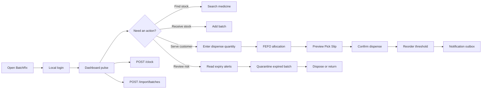

# BatchRx

> **A calmer way to manage pharmacy stock.**
>
> BatchRx turns expiry dates into clear shelf actions: search in-date stock in seconds, dispense from the earliest-expiring batch, and move expired inventory through an auditable quarantine flow.


## The idea

Pharmacies do not really have one quantity of a medicine. They have several physical batches, each with its own expiry date and shelf location. BatchRx makes that reality visible and operational:

- **Search answers the customer question:** “Do we have this in date?”
- **FEFO protects the shelf:** the batch expiring first is always selected first.
- **Health scores surface risk:** the medicines needing attention rise to the top.
- **Pick slips bridge software and shelf:** the pharmacist gets exact batch-by-batch pulling instructions.
- **Quarantine closes the loop:** expired stock is acknowledged, tracked, and resolved instead of disappearing.

This is a pharmacy control room built for a pharmacist working quickly behind a counter. The React client is paired with a small Node API so automation and grading workflows operate on one authoritative state.

## What is included

### Access

The app opens on a local login screen.

| Field | Demo value |
| --- | --- |
| Username | `admin` |
| Password | `admin` |

Sign-up is backed by the API and SQLite. Passwords are hashed with Node’s `scrypt`, and login returns a server-side session token. The included `admin` account is seeded for demonstration. This is suitable for the challenge, but production deployment would still need stronger operational security, secret management, and role-based permissions.

### Public landing page

Before login, visitors see a scrollable product story rather than an empty sign-in wall. The landing page explains:

- The pharmacy problem and BatchRx’s FEFO approach
- The three-step workflow: find, pull, and close
- The live pulse, Waste Radar, audit trail, and reorder action center
- The intended audience: neighborhood pharmacies and small teams
- Three future directions: supplier orders, barcode intake, and team audit

The page uses restrained page-load and pulse animations with `prefers-reduced-motion` support. Its calls to action open the real login and dashboard flow.

### Profile preferences

After login, the `AR` profile button opens a workspace menu with:

- **Light theme**
- **Dark theme**
- **Log out**

The selected theme persists in browser storage. Logout clears the local session markers and returns to the landing page.

### Daily clock automation

The API exposes a deterministic daily job through `POST /clock`. It flags active batches expiring within 7 days, quarantines active batches that are already expired, and reports the counts. Repeating the same clock date is safe and does not double-count work.

### Messy batch import

`POST /import/batches` accepts normalized JSON rows or messy input values such as `"10 units"`, ISO dates, and `dd/mm/yyyy` dates. Each import returns:

```json
{
   "imported": 1,
   "deduped": 1,
   "rejected": 1,
   "rejections": [{ "row": 3, "reason": "Missing medicine" }]
}
```

Duplicate medicine, batch, and expiry combinations are deduplicated. Invalid or unsafe rows are rejected with a row number and reason rather than being partially trusted.

### Re-order notifications

Medicines have a reorder threshold. When a dispense, import, or clock action moves in-date stock below that threshold, the API emits a `REORDER_REQUIRED` message. Messages are observable through `GET /outbox`, which acts as the local Notification Service outbox for this challenge.

### Explainable dispensing

The Pick Slip does more than list quantities. It explains the decision in operator language:

- The first row is the earliest in-date batch.
- Later rows are the next earliest in-date batches used when the first batch cannot fulfil the request.
- Expired stock is explicitly excluded.

This makes FEFO inspectable and builds trust in the automation instead of asking the pharmacist to accept a mysterious allocation.

### Waste radar

The dashboard includes a Waste Radar showing the number of sellable units inside the 30-day expiry window. Medicines are ranked by at-risk units so the team can act before stock becomes waste. The radar intentionally reports units, not invented monetary values, because the current inventory model does not contain purchase prices.

### Reorder action center

Pending reorder events are surfaced beside alerts in an Action Center. Each signal shows the current in-date quantity, the reorder threshold, and a one-click path to create a reorder draft. This turns the Notification Service outbox from a hidden integration detail into useful pharmacist work.

### Pagination and sorting

The dashboard supports pagination and sorting by health score, medicine name, and stock level. The API supports the same behavior through query parameters:

```text
GET /medicines?page=1&pageSize=6&sort=healthScore&order=asc
GET /batches?page=1&pageSize=20&sort=expiry&order=asc
```

Responses include `items`, `page`, `pageSize`, `total`, and `totalPages` so another client can build the same browsing experience.

### Dashboard

The dashboard provides a quick morning pulse:

- Sellable, in-date unit count
- Batches expiring within 30 days
- Expired batches awaiting action
- Number of dispense records
- Medicine cards sorted by computed health score, worst first
- Filters for all stock, under 7 days, under 30 days, and fully expired stock

### Omni-search

Type part of a medicine or generic name into the search bar. Results appear immediately with the current sellable quantity. Expired or quarantined quantities are excluded from these numbers.

### Add batch

Use **Add batch** to record arriving stock. The form validates:

- Medicine selection or inline medicine creation
- Required, per-medicine batch code
- Positive quantity
- Future expiry date
- Received date

New batches are persisted to browser storage and immediately affect stock totals and health scores.

### Dispense and Pick Slip

The dispense flow has two deliberate steps:

1. Choose a medicine and enter the requested quantity.
2. Preview the generated Pick Slip before changing stock.

The slip lists each batch in expiry order, including the exact quantity to pull and the expiry date. If the request is larger than the sellable stock, BatchRx shows a partial-fill warning and the slip reflects only what is available. Confirmation then deducts the allocated quantities and records a dispense log.

### Expiry alerts

The alert feed is always visible beside the stock overview. It groups active batches into:

- **Expired:** expiry date is today or earlier
- **Under 7 days:** urgent, still sellable stock
- **Under 30 days:** early warning

Expired alerts have a **Quarantine batch** action. The alert does not silently mutate stock: the pharmacist explicitly acknowledges the physical action.

### Quarantine zone

Quarantined batches remain in the system with their quantity and history. The pharmacist can:

- Mark the batch **disposed**
- Mark the batch **returned to supplier**

Neither action hard-deletes a batch. This keeps the audit trail meaningful and prevents expired inventory from being mistaken for missing data.

### Batch inspection

Every medicine card has a **View batches** action that reveals the batch code, quantity, expiry, received date, and status for that medicine.

## Product flow at a glance



## API contract

The backend runs on port `8787` by default. Both the short grading paths and `/api` paths are supported:

| Method | Endpoint | Purpose |
| --- | --- | --- |
| `GET` | `/health` | Service health check |
| `GET` | `/state` | Read the authoritative pharmacy state |
| `POST` | `/clock` | Flag near-expiry batches and quarantine expired batches |
| `POST` | `/import/batches` | Normalize, validate, deduplicate, and import batch rows |
| `POST` | `/dispense` | Apply a FEFO dispense and emit reorder events when needed |
| `GET` | `/outbox` | Inspect pending Notification Service messages |
| `POST` | `/auth/register` | Register a user and create a session |
| `POST` | `/auth/login` | Authenticate a user and create a session |
| `GET` | `/medicines` | Paginated, sortable medicine inventory |
| `GET` | `/batches` | Paginated batch inventory, optionally filtered by medicine |
| `POST` | `/reset` | Reset the SQLite demo state for testing |

Example clock request:

```bash
curl -X POST http://localhost:8787/clock \
   -H 'Content-Type: application/json' \
   -d '{"date":"2026-09-17"}'
```

Example import request:

```bash
curl -X POST http://localhost:8787/import/batches \
   -H 'Content-Type: application/json' \
   -d '{"rows":[{"medicine":"Paracetamol 500mg","batch":"A002","quantity":"10 units","expiry":"17/10/2026"}]}'
```

The Vite development server proxies `/api/*` to the backend. Direct grading clients can use either `/clock` or `/api/clock`, and the equivalent forms for the other endpoints.

## FEFO in plain language

FEFO means **First Expiry, First Out**. It is different from FIFO: the batch received first is not necessarily the batch that expires first.

For a request of 30 strips, if the earliest active batch contains 10 strips and the next batch contains 84, BatchRx returns:

```text
Pull 10 from the earliest batch
Pull 20 from the next batch
```

Expired batches are never included. If only 18 strips are sellable, the result is a partial fill of 18 plus a shortfall of 12. The UI makes this explicit before confirmation.

## Health score

Each medicine receives a score from 0 to 100. Lower means more urgent.

The score starts at 100 and applies two penalties:

1. **Earliest expiry penalty**
   - Under 7 days: subtract 50
   - Under 30 days: subtract 30
   - Under 60 days: subtract 10
2. **Near-expiry proportion penalty**
   - Calculate the proportion of sellable quantity expiring within 30 days.
   - Subtract `floor(proportion × 30)`.

The final score is clamped between 0 and 100. Expired-only medicines score 0 and remain visible so the problem cannot hide in an empty-state card.

## Technical stack

| Layer | Choice | Why it is here |
| --- | --- | --- |
| UI | React 19 | Component-based workflows and predictable local state |
| Build | Vite 8 | Fast development server and production bundling |
| API | Node.js HTTP server | Deterministic clock, import, dispense, and outbox endpoints |
| Database | SQLite via Node `node:sqlite` | Real file-backed persistence with relational constraints |
| Language | JavaScript / JSX | Small client-side product with no type-system overhead yet |
| Styling | Tailwind CSS 3 | Consistent clinical visual system with fast responsive layout work |
| State | Context API + `useReducer` | One central pharmacy state and explicit domain actions |
| Persistence | API memory + `localStorage` fallback | One authoritative API state with standalone UI fallback |
| Integration | Notification outbox | Observable reorder messages for downstream services |
| IDs | `crypto.randomUUID()` | Native unique identifiers for batches, medicines, and logs |
| Validation | Oxlint | Fast static checks |

## Project structure

```text
batchrx/
├── server/
│   ├── domain.js                   # Shared clock, sellable stock, and reorder rules
│   ├── importer.js                 # Messy row normalization and import reports
│   ├── index.js                    # HTTP API routes
│   ├── db.js                       # SQLite schema, queries, auth, persistence
│   └── store.js                    # Database-backed state compatibility layer
├── public/
├── src/
│   ├── components/
│   │   ├── AddBatchModal.jsx       # Stock intake and new medicine creation
│   │   ├── AlertFeed.jsx           # Expiry buckets and quarantine action
│   │   ├── BatchListModal.jsx      # Batch-level inspection
│   │   ├── DispenseModal.jsx       # Quantity entry and FEFO preview
│   │   ├── LoginPage.jsx            # Local demo access gate
│   │   ├── MedicineCard.jsx         # Stock and health summary
│   │   ├── PickSlip.jsx              # Shelf pulling instructions
│   │   ├── QuarantinePanel.jsx       # Dispose / return actions
│   │   ├── ReorderCenter.jsx          # Reorder threshold action cards
│   │   └── SearchBar.jsx             # Instant in-date stock lookup
│   │   ├── WasteRadar.jsx             # Units approaching expiry
│   ├── context/
│   │   └── PharmacyContext.jsx      # Reducer, actions, and persistence wiring
│   ├── data/
│   │   └── seed.js                   # Demo medicines and varied batch states
│   ├── engine/
│   │   ├── api.js                    # Frontend API bridge
│   │   ├── fefo.js                   # Pure sellable stock and allocation logic
│   │   ├── healthScore.js             # Expiry and medicine health calculations
│   │   └── storage.js                 # Versioned localStorage wrapper
│   ├── pages/
│   │   ├── Dashboard.jsx              # Main pharmacy control surface
│   │   └── LandingPage.jsx            # Public product story and entry point
│   ├── App.jsx
│   ├── index.css
│   └── main.jsx
├── postcss.config.js
├── tailwind.config.js
├── package.json
└── package-lock.json
```

## Run locally on your computer

BatchRx runs as a local Vite development app in your browser. You need:

- Node.js 22 or newer (Node 24 LTS recommended because BatchRx uses built-in `node:sqlite`)
- npm, installed with Node.js
- Git, if you are downloading the project from GitHub

### 1. Download the project

From a terminal, clone the repository and enter the project folder:

```bash
git clone <your-github-repository-url>
cd Auriga/batchrx
```

If the project is already on your computer, open a terminal in the `batchrx` folder instead. The folder must contain `package.json`.

### 2. Install dependencies

Run this once after cloning, or whenever `package.json` changes:

```bash
npm install
```

### 3. Start the API server

Open a first terminal in `batchrx` and run:

```bash
npm run server
```

The API will be available at `http://localhost:8787`.

### 4. Start the development server

Open a second terminal in the same `batchrx` folder and run:

```bash
npm run dev
```

Vite prints a local address in the terminal. Open the displayed URL, normally:

```text
http://localhost:5173/
```

If port `5173` is already being used, Vite automatically chooses another port, such as `5174` or `5175`. Use the exact URL printed in your terminal.

### 5. Sign in

The first screen is the local BatchRx access page. Use the demo credentials:

```text
Username: admin
Password: admin
```

After signing in, you can search stock, add batches, dispense medicine, review Pick Slips, quarantine expired batches, and resolve them as disposed or returned.

### Important directory note

Run `npm run dev` from `batchrx`, not from the parent `Auriga` folder:

```bash
# Correct
cd /path/to/Auriga/batchrx
npm run dev
```

If npm reports `Could not read package.json`, you are in the wrong directory. Run `cd batchrx` and try again.

To stop the server, return to the terminal running Vite and press `Ctrl+C`.

Useful commands:

```bash
npm run server      # Start the API on port 8787
npm run dev:server  # Start the API with Node watch mode
npm run build      # Production build
npm run preview    # Preview the production build locally
npm run lint       # Run Oxlint
```

## Database and persistence

BatchRx uses a real SQLite database at `data/batchrx.sqlite`. The database is created automatically when the API starts. Its schema includes:

- `users`: registered accounts with scrypt password hashes
- `sessions`: expiring login sessions
- `medicines`: product metadata and reorder thresholds
- `batches`: quantities, lot codes, expiry dates, statuses, and lifecycle timestamps
- `dispense_logs`: immutable dispense summaries and Pick Slip allocations
- `outbox`: pending reorder notification events
- `clock_runs`: automation history and processed counts

The browser also keeps a local reducer snapshot under `batchrx-state` as a UI fallback. When the API is running, the React app hydrates from the SQLite-backed API and synchronizes state through `/api/state`.

The SQLite file is ignored by Git. Never commit runtime databases, user accounts, or session data.

### Reset demo data

To reset the demo data, open browser developer tools and run:

```js
localStorage.removeItem('batchrx-state')
localStorage.removeItem('batchrx-authenticated')
location.reload()
```

To reset the server database, run:

```bash
curl -X POST http://localhost:8787/reset \
   -H 'Content-Type: application/json' \
   -d '{"date":"2026-09-17"}'
```

## Scope and production boundary

This repository is a working full-stack product and a complete demonstration of the core pharmacy workflow. It is not yet a regulated pharmacy deployment. Before real pharmacy use, it would need:

- Production-grade authentication and authorization policies
- Encrypted, backed-up, hosted database operations
- Multi-user audit identity
- Formal regulatory and clinical review
- Server-side validation and conflict handling
- Automated unit, integration, and browser tests
- A controlled migration strategy for real inventory data

The current auth flow is real for this local challenge, but it is intentionally minimal and should be hardened before handling real patient or pharmacy data.

## Design language

BatchRx uses a quiet clinical palette, high-contrast text, compact information blocks, and direct action language. The interface is intentionally built around relief: the pharmacist should see what is safe to sell, what needs attention, and what physical action comes next without interpreting a spreadsheet.

For the product rationale behind these choices, read [REASONING.md](REASONING.md).
